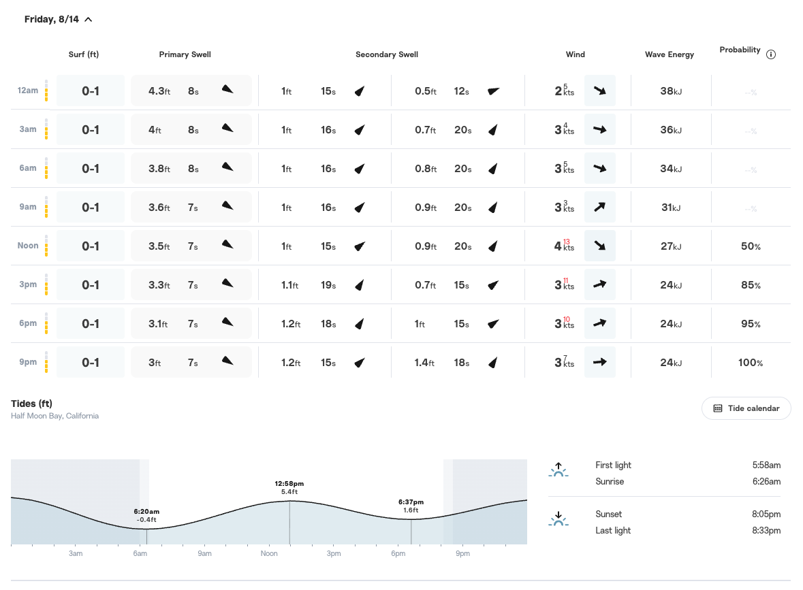
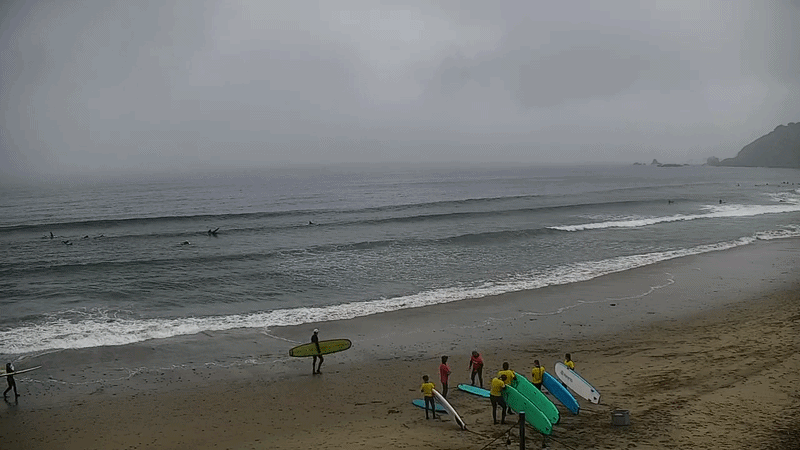
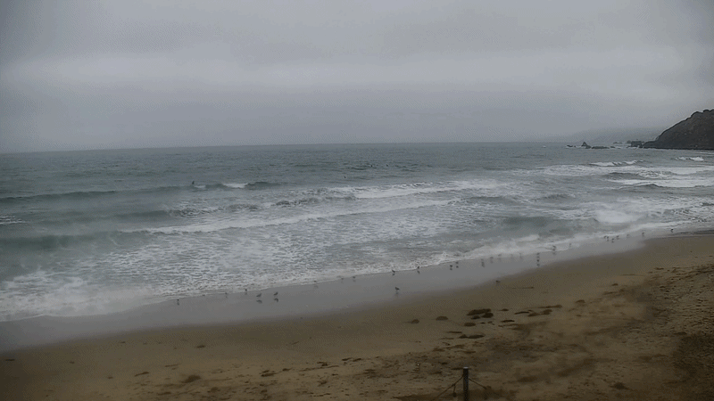

+++
date = '2026-08-16T20:42:47-07:00'
draft = false
title = 'This Is My Ideal Surfing Condition in 2026'
tags = ['surfing', 'notes', 'linda mar', 'surf condition', 'waves', 'surf forecast']
categories = ["Surfing"]
+++

As the wrap up post mentioned, [I surfed five times in July]() - an all-time high record in a single month. It also blows past the surfing goal I have for 2026. I am very happy about it, am getting visibly tanned bc of it, and more importantly, discovered what kind of day is most suitable for me to surf.

Here’s the context: my surfing location has been Linda Mar in Pacifica, California. It’s a known beginner beach but sometimes the waves can be brutal. It is the worst (for me) when waves are powerful but also frequent/mixed, or with strong wind. They make it harder to catch waves but also much harder to paddle out. It is a nonstop blowout waves near shore, and fighting against them while paddling out is very exhausting especially with a foam longboard (hard shortboard is easier to duck blowouts). 

Until recently, I didn’t exactly know how to read surf forecast and predict the conditions. I know wind has to be small but that’s about it. Frequent surfing this month makes me more aware of the conditions, and I finally found out the most suitable forecast for me. I call it “clean and small”, and it looks like this:

It comes down to 4 different conditions:

* Surf height <3ft: this is the height of the wave at peak. I have surfed higher but especially for Linda Mar 3ft is a good max to ensure a wave that I can handle
* Swell: this is a bit more complicated. Basically it has to have <6ft primary swell and <2ft secondary swell, and preferably primary has >7s interval. 
  * Small secondary swell ensures waves are clean, meaning I can focus on the primary swell and not worry about secondary swell that becomes big - the latter usually happens if it’s >2ft and has a long interval e.g. > 9s. 
  * Long primary swell interval just means we have reasonable wait period
* Wind and gust both < 9kts: this is smaller the better, and the strong wind blows out the waves and make waves mush at the peak, making it harder to ride and take off
* Nearshore energy: <80kJ: this shows how strong and powerful waves can be, and I generally find it easier to deal with in this range

Combine all conditions together means a productive day for me, and the waves look like this (and me taking off):

So I get:

* Waves are clean and straightforward to tell
* Paddling out is easy with smaller waves and longer quiet period in between
* Usually there are multiple spots on the wave for us to catch because clean waves usually stretches long in Linda Mar
* Waves also tend to peel longer and close out less often
* The downside is waves tend to be small, but they still work for beginners like me

As a counter example, here’s how waves of a bad condition look like:

In this video, waves are visibly more frequent and all over the place, closet out more quickly, choppier and mushier. Note near shore how there are almost constant closeouts. Those make paddling out very challenging with a big board. In contrast, the good wave above and the ocean in general are both much gentler and slower. 

I have surfed this ideal condition a few times now, and can successfully catch and take off ~15 times in a span of ~2 hours, which is record high for me (used to be ~5). I also enjoy a lot more than before when I have to battle with my patience because takeoffs are rare. Now my next goal is to learn how to properly ride the wave down the line along the shoulder - I will write a separate post and explain exactly what it means.

That’s it. I feel really really good about surfing 5 times in a month. It might be more than what I had for the entire 2025. I don’t think this is sustainable but I will try to surf 1-2 times a month onwards - frequency does matter for the experience and progression of skills.