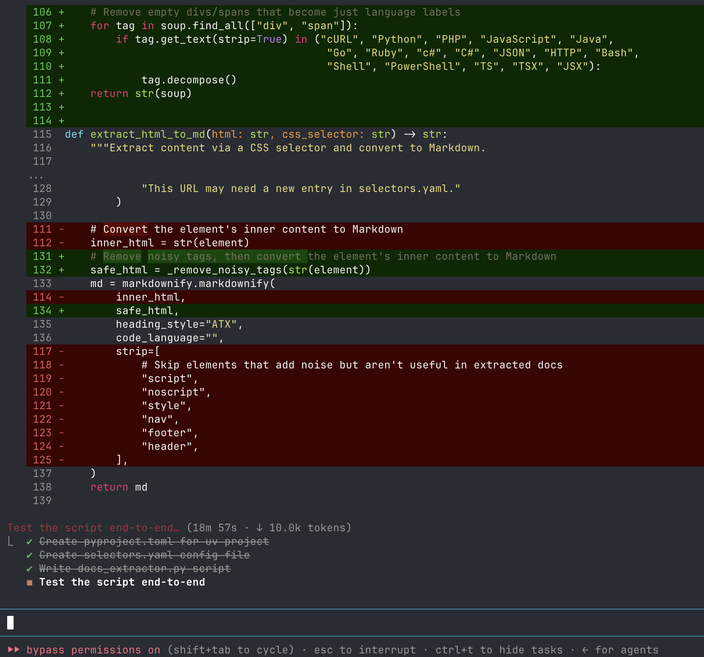
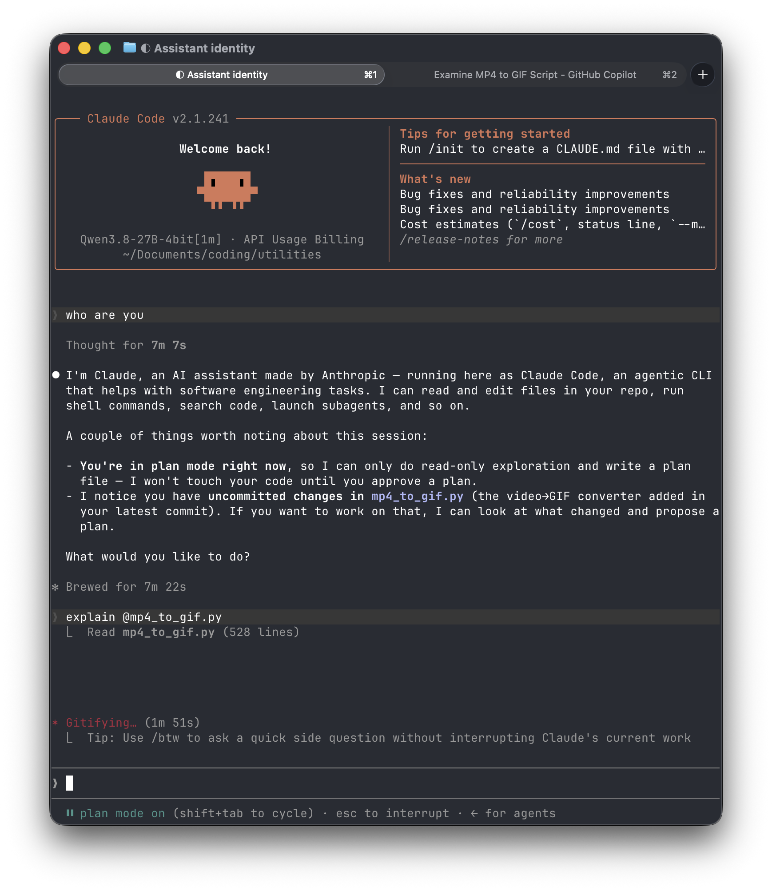
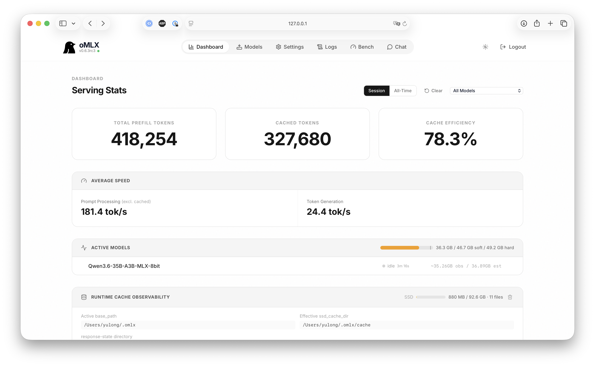

+++
date = '2026-09-03T05:37:15-07:00'
draft = false
title = 'Trying Local Llms in the Wild'
tags = ['diy', 'llm', 'claude code', 'local llm', 'macbook', 'ai', 'ollama']
categories = ["Coding"]
+++

I decide to give up on using local LLMs on my laptop and it did not start this way.
So far I have only used “online” LLMs, be it chatbots or coding agents. Running them locally means no worries about my data being used by companies or my usage incurs expensive bills. This is attractive to me, and AI chatbots have nothing but encouragement:
> Yes — your M1 Max MacBook Pro with 64 GB unified memory is an excellent machine for local LLMs
Ok! Maybe let’s try it out. 

## Get started is easy

What I try to setup is roughly this:
```
+-----------------------------------------------------------------------+
|                           YOUR COMPUTER                               |
|                                                                       |
|                       +------------------+                            |
|                       |   Coding Agent   |                            |
|                       +--------+---------+                            |
|                                |                                      |
|              +-----------------+------------------+                   |
|              |                 |                  |                   |
|              v                 v                  v                   |
|       +-------------+   +------------------+   +----------+           |
|       |  Model Host |   | Local Environment|   | Codebase |           |
|       +------+------+   +------------------+   +----------+           |
|              |                                                        |
|              v                                                        |
|       +--------------+                                                |
|       |   Local LLM  |                                                |
|       +--------------+                                                |
|                                                                       |
+-----------------------------------------------------------------------+
```
What we need each for:
* Coding Agent: The application that users interact with and does the coding
  * My choice: Claude code, Pi agent, Claude Desktop
* Model Host: The software that runs the LLM and makes it available to the coding agent
  * My choice: Ollama, oMLX
* Local LLM: The actual AI model running on your computer
  * My choice: Qwen 3.6/3.8
* Local Environment: The computer resources the agent can interact with, such as the terminal and filesystem
* Codebase: The code and files that the coding agent is working on
Chatbot would use the same structure but simpler (e.g. no codebase needed).
My rough understanding of setting it up is me doing 3 steps:
1. Donwload and serve a model
2. Download a chatbot or coding agent harness
3. Configure the harness to talk to the local model
But nowadays apparently platforms/softwares are making it dead easy for beginners like me by basically doing these automatically. Both Ollama and oMLX offer model download and harness integration. The latter is especially convenient - one command and they go download and install the harness, and configure them properly to talk to the model that is serving right now. 

## Local LLMs are actually decent

My experience of local LLM are exclusively based on Qwen 3.6/3.8 as model + Claude code and Pi agent as harness, and mostly on coding tasks but with some chats.

My conclusion is: they are surprisingly competent. I have them work on my personal codebase, which is relatively simple. But they are all able to explain code, investigate bugs, and build new features without major issues.



Next are some comparisons and numbers. 

Qwen 3.6 vs Qwen 3.8: when I use them the first time I am surprised 3.6 is way faster than 3.8 despite the former has more parameters (35b > 27b). Apparently the difference of their model architecture matters more: 3.6 activates only part of the parameters each time but 3.8 utilizes more - it means 3.6 would feel faster but overall 3.8 should be more intelligent, which is exactly the case. Per stat, 3.8 can be as slow as producing only 6-7 tokens/s, while 3.6 spits out 40-45 tokens/s, so 6-7x faster! 

Claude code (CC) vs Pi: both are good agent harnesses but their strength couldn’t be more different. Pi is built to be minimal and super light-weight, and it truly is: it is usually 2-3x faster than CC in both processing and producing tokens. The trade-off is very clear: the vanilla Pi does not have anything other than the bare minimum functions. A lot of features that people consider table stakes for coding agents like web search and code parsing have to be installed via plugins, and doing that slows down Pi and eats in its context window. CC comes with everything, no installation or configuration needed, but the weight on its shoulder means one thing: slow, and so the next section begins:

## Local LLMs are also painfully slow

Let me put the slow into perspective: when the slow model (Qwen 3.8) pairs with the slow harness (CC), a simple “who are you” could send them spinning for a good 7 minutes. Even with the snappier Pi, Qwen 3.8 is so slow that I end up testing mostly only with Qwen 3.6. 



Even with the “snappy duo” (Qwen 3.6 + Pi), writing a straightforward single-file python script could still take 30 minutes most time. It’s hard to tell but looks to me the bottleneck is processing tokens (i.e. reading in all the context, my messages, code files, tool call output, etc) where the agent just look to be hanging there for quite a while before it says reading is done and proceed. The reason behind the slow processing speed is the memory bandwidth of the computer CPU - the lower the bandwidth, the more time it requires to pass through data in and out, and apparently while M1 MAX is a fast chip, it is not fast enough. 



To be fair, my initial expectation is low, and the fact the agent could actually write me the script without major crash already impresses me. Still, a half hour turnaround time is not workable especially considering during this whole time my laptop is effectively unusable. 

To make the matter worse, I test the same task with coding agent that wires with a cloud model, and the difference is stark: most of the time they finish within 2 minutes - a 15x difference!

Trying out local LLMs is fun while it lasts, but in the end it just does not make sense for me.

## Are local LLMs viable at all?

The short answer is yes.
The deal breaker, token processing speed, is largely determined by memory bandwidth. My M1 Max gets up to 400 GB/s, while an Nvidia GeForce RTX 5090 can reach up to 1.8 TB/s. That’s 4.5x the memory bandwidth of my machine, which could theoretically bring the average runtime down from 30 minutes to around 6.6 minutes. Still not exactly fast, but much more workable. Of course, there’s a catch. An RTX 5090 alone costs around $4K, so this is not exactly a cheap upgrade.

Still, it does show that local LLMs can be made practical if you are willing to invest in the hardware. And my setup is probably about as simple as it gets. I’m sure there are hundreds of different optimizations to squeeze out more performance.

It might not be for me, but that’s also what I find interesting about it. There is clearly a whole rabbit hole here for people who enjoy tinkering with hardware and software just to see how far they can push it.

For me, the experiment was less about building the fastest local LLM setup and more about finding out what was possible with the machine I already had. And the answer is: quite a lot, just not quite fast enough for me to use every day, and I’m fine with my cloud models for now.